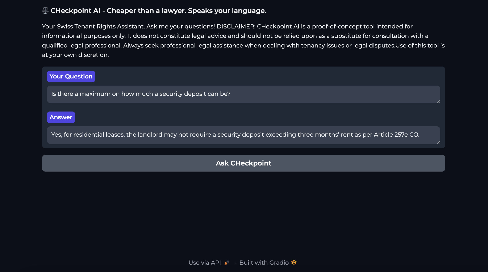

# ⚖️ CHeckpoint AI
> Cheaper than a lawyer. Speaks your language.


## Description 

An AI-powered legal assistant that helps tenants in Switzerland understand their rights, detect legal violations, and generate formal complaints. Built with GPT-4, LangChain, and RAG.

Created to protect those most vulnerable to housing exploitation, which primarily concerns students, expats and international hires, it serves as a characteristic example of technology for the benefit of society.

### DISCLAIMER

CHeckpoint AI is a proof-of-concept tool intended for informational purposes only. It does not constitute legal advice and should not be relied upon as a substitute for consultation with a qualified legal professional. Always seek professional legal assistance when dealing with tenancy issues or legal disputes.Use of this tool is at your own discretion.

## How it works

CHeckpoint AI uses a Retrieval-Augmented Generation (RAG) pipeline powered by LangChain, OpenAI’s embedding models, and Chroma for semantic search.

The backend loads legal text documents, splits them into manageable chunks, embeds them into a vector database (Chroma), and allows the user to query this knowledge base using natural language. When a user submits a question, the app retrieves the most relevant context and passes it to a GPT-based model to generate a tailored response.

A simple Gradio interface serves as the front end, enabling an interactive chat experience without requiring technical knowledge.

### Tech-Stack:
    •    Language: Python 3.9
    •    Frontend: Gradio (https://www.gradio.app/) — lightweight UI for ML apps
    •    Backend:
    •    LangChain (https://www.langchain.com/) — framework for LLM pipelines
    •    OpenAI GPT-4 (https://platform.openai.com/docs/models/gpt-4) — for generating legal answers
    •    ChromaDB (https://www.trychroma.com/) — vector database for semantic search
    •    Embeddings: text-embedding-ada-002 from OpenAI
    •    Environment & Secrets: .env file with python-dotenv (https://pypi.org/project/python-dotenv/)
    •    Version Control: Git + GitHub
    •    Packaging: requirements.txt

## Setup

### 1 - Clone the repository

``` 
    git clone https://github.com/your-username/CHeckpoint.git
    cd CHeckpoint 
```

### 2 - Create and activate a virtual environment

``` 
    python3 -m venv venv
    source venv/bin/activate
```

### 3 - Install the required dependencies

``` pip install -r requirements.txt ```

### 4 - Add your API key

Create a .env file in the root directory.
Add your OpenAI key like this:
``` python
OPENAI_API_KEY=your_api_key_here
```
### 5 - Run the app

python rag_engine.py

### 6 - Access the UI

The app will run on http://127.0.0.1:7860

To generate a public Gradio link, set share=True in app.launch() in the script.

The app looks like this:




## Suggested prompts

Seeing as CHeckpoint is currently trained in only three articles from the Swiss Code of Obligations - namely 257e, 257f and 266g - it can only answer questions relating to these articles. Topics include security deposits, lanlord's right of entry, tenant obligations and early contract termination due to just motives.

Here is a list of suggested prompts: 

1) Can my landlord enter the house without prior notice?
2) Is there a limit on how much a security deposit can be?
3) What are the conditions for the release of a deposit from the bank?
4) What are my obligations as a tenant?
5) Can I terminate my contract early if my living conditions are intolerable?

## Roadmap
This project is designed for iterative growth in the following three phases:

### Phase 1 - present: 
Build backend prototype using Retrieval-Augmented Generation (RAG)

### Phase 2: 
1. Expand dataset with multilingual legal sources and cantonal specificity
2. Introduce fine-tuning on Swiss tenancy law (if early-stage support secured)
3. Develop user-facing interface (chatbot, webapp, mobile support)

### Phase 3: 
Intergrate prompt engineering, RAG, and fine-tuned LLMs to build a powerful, specialized legal assistant capable of:

  - Understanding nuanced legal queries
  - Operating in multiple languages
  - Generating official documentation (e.g., complaint letters)
  - Potentially extend to broader legal domains like immigration, employment, and insurance law

  ## Contact
   You can find me on LinkedIn at:
   www.linkedin.com/in/vasiliki-mikaela-sdona-718023364